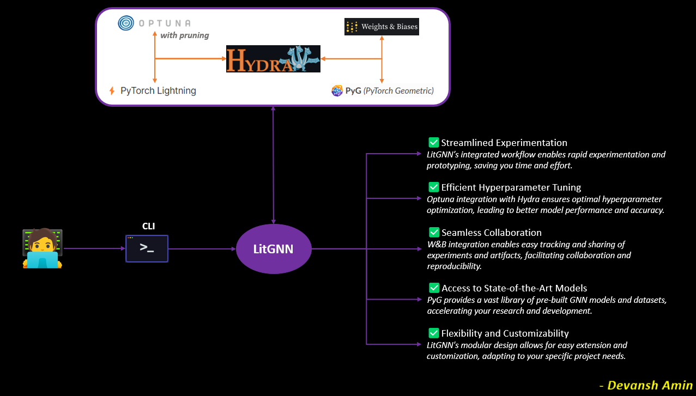

<div align="center">
<h1>LitGNN: Unleash the Power of Graph Neural Networks</h1>

**Experiment, Optimize, and Innovate with Ease.**



______________________________________________________________________

</div>

# Welcome to LitGNN

LitGNN is a GNN experimentation playground that combines the best of:
* **🐉Hydra**: Effortless CLI and configuration management.
* **📊Weights and Biases**: Track experiments and artifacts with ease.
* **🎯Optuna**: Hyperparameter optimization made simple with seamless Hydra integration.
* **🕸️PyTorch Geometric (PyG)**: Implement and explore state-of-the-art GNN models and datasets.
* **⚡PyTorch Lightning**: Streamline your workflow with lightning-fast training.

Following datasets are currently supported,
|Dataset type|Group|Datasets|
|:-:|:-:|:-:|
|`molecule_net`||[PyG MoleculeNet datasets](https://pytorch-geometric.readthedocs.io/en/latest/generated/torch_geometric.datasets.MoleculeNet.html)|
|`custom`|TDC|[ADMET Benchmark datasets](https://tdcommons.ai/benchmark/admet_group/overview/)|
|`custom`|Biogen|[ADME datasets](https://github.com/molecularinformatics/Computational-ADME/tree/main/MPNN)|

## Get started

### Create .env file

Create a `.env` file similar to [.env.example](.env.example) file, and fill out the values for each variables in the `.env` file.

### Install LitGNN

> \[!Note\]
> The following shell script will create a conda env named `litgnn` and install the necessary dependencies.

```bash
# CPU (default)
bash scripts/setup_env.sh
# GPU
bash scripts/setup_env.sh cu118
```

## Training recipes

Browse all training recipes [here](./examples).

## License

LitGNN is released under the [Apache 2.0](https://www.apache.org/licenses/LICENSE-2.0) license. See the [LICENSE](LICENSE) file for details.
